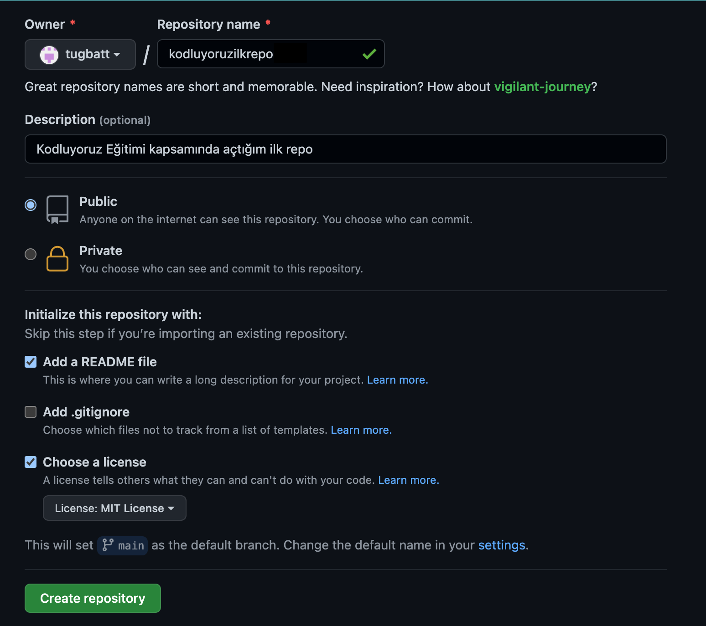

# kodluyoruzilkrepo
Bu repo [Kodluyoruz](https://www.kodluyoruz.org/) Java Backend Eğitimi 
kapsamında açtığım ilk repo içerisinde bir adet README.md dosyası, bir adet de index.html barındırıyor. 



## Installation

Öncelikle projeyi clonelayın.
```bash
git clone https://github.com/tugbatt/kodluyoruzilkrepo.git
``` 

## Usage

Projeyi cloneladıktan sonra Visual Studio Code programında açınız.

Linux için:

```linux
cd kodluyoruzilkrepo 
code .
```
## Contributing


Pull requestler kabul edilir. Büyük değişiklikler için, lütfen önce neyi değiştirmek istediğinizi tartışmak için bir konu açınız.

## License

[MIT](https://choosealicense.com/licenses/mit/)